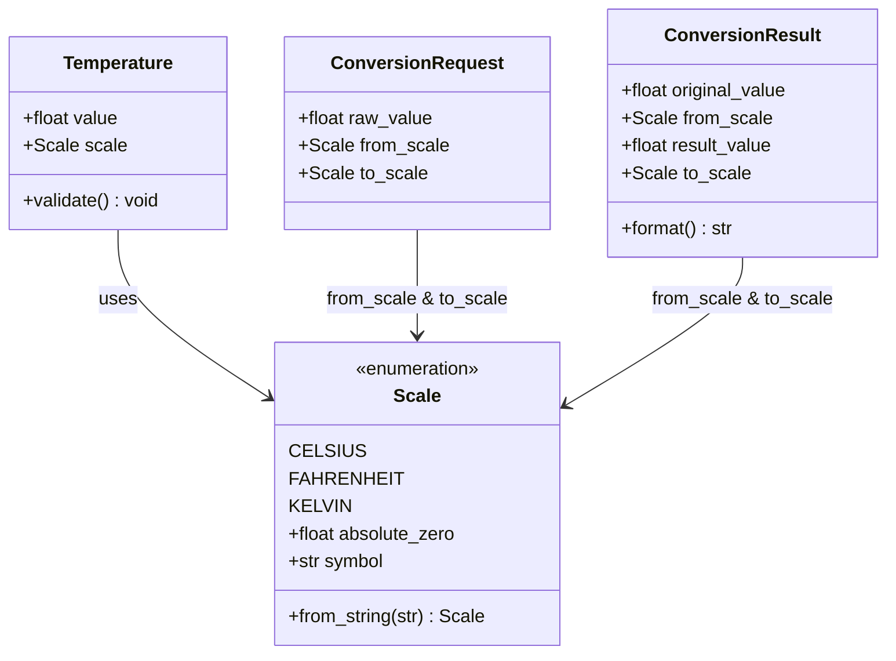

# Data Model: Convertidor de Temperatura

**Feature**: `001-temperature-converter`
**Status**: Completed

## Overview

El modelo de datos describe las entidades y estructuras de valor utilizadas por el motor de conversión de temperatura, así como sus reglas de validación y límites físicos invariantes.

---

## Entidades y Objetos de Valor (Value Objects)

### 1. `Scale` (Enumeración de Escalas Termométricas)

Representa las unidades termométricas reconocidas por el sistema.

- **Valores posibles**:
  - `CELSIUS`: Escala centígrada (°C)
  - `FAHRENHEIT`: Escala Fahrenheit (°F)
  - `KELVIN`: Escala termodinámica absoluta (K)
- **Normalización**:
  - El sistema acepta cadenas insensibles a mayúsculas/minúsculas:
    - Para `CELSIUS`: `"c"`, `"celsius"`, `"°c"`, `"c"`
    - Para `FAHRENHEIT`: `"f"`, `"fahrenheit"`, `"°f"`, `"f"`
    - Para `KELVIN`: `"k"`, `"kelvin"`
- **Límites Físicos (Cero Absoluto)**:
  - `CELSIUS`: Valor mínimo permitido = `-273.15`
  - `FAHRENHEIT`: Valor mínimo permitido = `-459.67`
  - `KELVIN`: Valor mínimo permitido = `0.00`

---

### 2. `Temperature` (Objeto de Valor)

Representa una medición de temperatura fija y validada en una escala dada.

- **Atributos**:
  - `value` (`float`): Magnitud numérica de la temperatura.
  - `scale` (`Scale`): Escala termométrica correspondiente.
- **Invariantes y Reglas de Validación**:
  - `value` debe ser un número finito (no se permite `NaN`, `+Infinity`, `-Infinity`).
  - `value` debe ser estrictamente mayor o igual al cero absoluto correspondiente a su `scale`:
    $$\text{value} \ge \text{scale.absolute\_zero}$$
- **Comportamiento**:
  - Inmutable tras la instanciación.

---

### 3. `ConversionRequest` (Solicitud de Conversión)

Representa la intención de transformar una temperatura desde una escala de origen hacia una de destino.

- **Atributos**:
  - `raw_value` (`float` o `str`): Entrada numérica provista por el usuario o llamador.
  - `from_scale` (`Scale` o `str`): Escala de origen solicitada.
  - `to_scale` (`Scale` o `str`): Escala objetivo solicitada.
- **Validación**:
  - `raw_value` debe ser parseable a `float`. Si falla la conversión, se produce un error de entrada no numérica.
  - `from_scale` y `to_scale` deben resolver a miembros válidos de `Scale`.
  - El valor numérico parseado debe respetar el cero absoluto de `from_scale`.

---

### 4. `ConversionResult` (Resultado de Conversión)

Representa la respuesta tras realizar exitosamente el cálculo de conversión.

- **Atributos**:
  - `original_value` (`float`): Valor de origen redondeado a 2 decimales.
  - `from_scale` (`Scale`): Escala de origen utilizada.
  - `result_value` (`float`): Valor convertido resultante, redondeado estrictamente a 2 decimales (`round(val, 2)`).
  - `to_scale` (`Scale`): Escala de destino resultante.
- **Representación de Cadena / Formato**:
  - Salida formateada estándar: `"{result_value:.2f} {to_scale.symbol}"` (por ejemplo: `"32.00 °F"` o `"273.15 K"`).

---

## Diagrama de Relaciones de Entidades

---

## Transiciones de Estado y Ciclo de Conversión

1. **Entrada**: El cliente provee `(valor, origen, destino)`.
2. **Validación Sintáctica**:
   - Se parsea el valor a `float`. Si falla $\to$ `InvalidTemperatureError`.
   - Se normalizan las escalas origen y destino. Si alguna es inválida $\to$ `InvalidScaleError`.
3. **Validación Semántica (Física)**:
   - Se compara el valor contra el cero absoluto de la escala de origen. Si es inferior $\to$ `AbsoluteZeroViolationError`.
4. **Transformación**:
   - Si `origen == destino` $\to$ valor resultante = valor de entrada.
   - De lo contrario, se aplica la fórmula termodinámica correspondiente.
5. **Post-procesamiento y Salida**:
   - Se aplica redondeo `round(resultado, 2)`.
   - Se construye y retorna `ConversionResult`.
