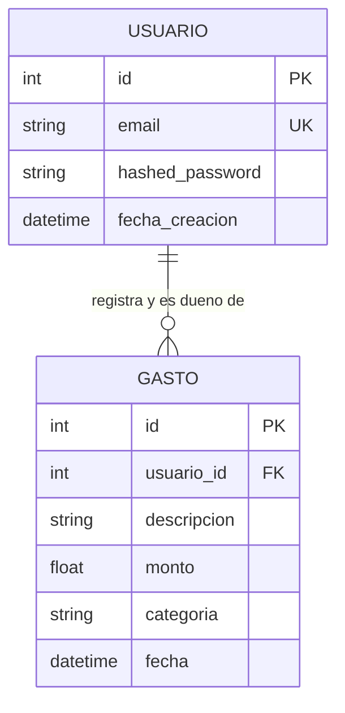

# Data Model: Sistema de Control de Gastos Personales

## Entidades Principales

### 1. Usuario (`app/models/usuario.py`)
Representa la cuenta de un usuario registrado en el sistema, asegurando identidad y aislamiento de datos.

- **Campos**:
  - `id`: `Integer`, Primary Key, autoincrement.
  - `email`: `String(255)`, único (`unique=True`), no nulo (`nullable=False`), indexado.
  - `hashed_password`: `String(255)`, no nulo (`nullable=False`). Almacena el hash bcrypt de la contraseña.
  - `fecha_creacion`: `DateTime`, default `datetime.utcnow`, no nulo.
- **Relaciones**:
  - `gastos`: Relación 1 a N con `Gasto`, `cascade="all, delete-orphan"`, `back_populates="usuario"`.
- **Invariantes y Reglas**:
  - El formato del email debe ser sintácticamente válido (validado con Pydantic `EmailStr`).
  - La contraseña nunca se almacena en texto plano ni se expone en schemas de respuesta (`UsuarioOut`).
  - El email es único a nivel de base de datos y validado previamente en la capa de servicios.

### 2. Gasto (`app/models/gasto.py`)
Representa una transacción financiera de gasto realizada por un usuario específico.

- **Campos**:
  - `id`: `Integer`, Primary Key, autoincrement.
  - `usuario_id`: `Integer`, Foreign Key a `usuarios.id`, no nulo (`nullable=False`), indexado.
  - `descripcion`: `String(255)`, no nulo (`nullable=False`).
  - `monto`: `Float`, no nulo (`nullable=False`).
  - `categoria`: `String(50)`, no nulo (`nullable=False`), indexado.
  - `fecha`: `DateTime`, default `datetime.utcnow`, no nulo.
- **Relaciones**:
  - `usuario`: Relación N a 1 con `Usuario`, `back_populates="gastos"`.
- **Invariantes y Reglas**:
  - `monto > 0.0`: Montos negativos o cero son inválidos y rechazados.
  - `descripcion.strip() != ""`: Descripciones vacías o con espacios en blanco son rechazadas.
  - `categoria`: Debe pertenecer exactamente al conjunto canónico (`comida`, `transporte`, `entretenimiento`, `otros`).
  - **Límite acumulado**: La suma acumulada histórica de gastos de un usuario en una misma categoría no puede exceder `500.0` tras registrar la transacción.
  - **Aislamiento**: Todo registro y consulta de `Gasto` está estrictamente atado al `usuario_id` del token JWT.

---

## Constantes y Enumeraciones de Dominio

- `CATEGORIAS_VALIDAS = ("comida", "transporte", "entretenimiento", "otros")`
- `LIMITE_POR_CATEGORIA = 500.0`

---

## Esquemas Pydantic / DTOs (`app/schemas/`)

Para desacoplar estrictamente la capa de presentación de los modelos SQLAlchemy (Artículo V.3):

### Schemas de Usuarios (`app/schemas/usuario.py`)
- **`UsuarioCreate`**:
  - `email`: `EmailStr`
  - `password`: `str` (longitud mínima 6 caracteres)
- **`UsuarioOut`**:
  - `id`: `int`
  - `email`: `EmailStr`
  - `ConfigDict(from_attributes=True)` (omite estrictamente `hashed_password`)
- **`Token`**:
  - `access_token`: `str`
  - `token_type`: `str = "bearer"`

### Schemas de Gastos (`app/schemas/gasto.py`)
- **`GastoCreate`**:
  - `descripcion`: `str` (min_length=1)
  - `monto`: `float` (gt=0.0)
  - `categoria`: `str`
- **`GastoOut`**:
  - `id`: `int`
  - `usuario_id`: `int`
  - `descripcion`: `str`
  - `monto`: `float`
  - `categoria`: `str`
  - `fecha`: `datetime`
  - `ConfigDict(from_attributes=True)`

---

## Diagrama Entidad-Relación

