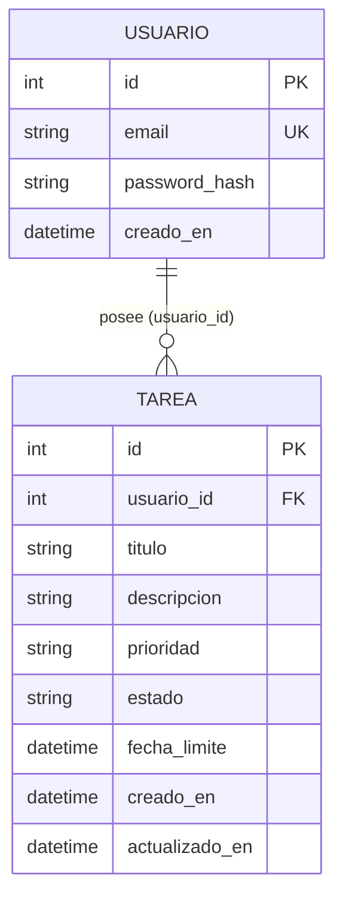
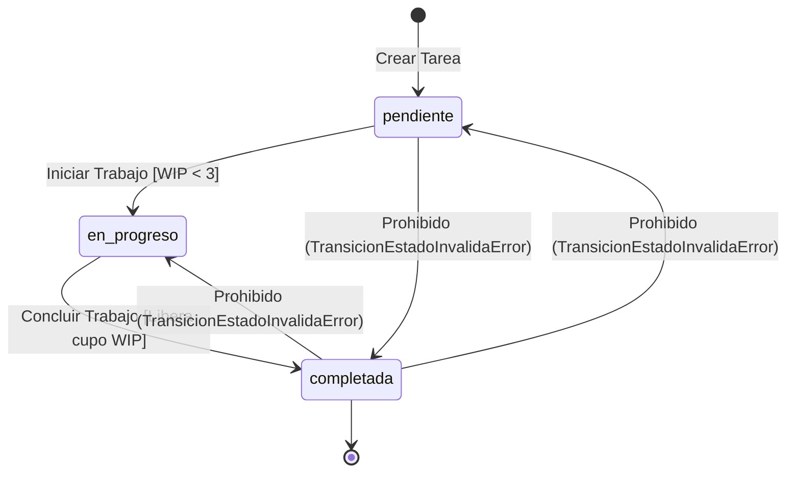

# Data Model & Business Invariants: Sistema de Gestión de Tareas con Límite de Capacidad

**Feature**: `001-task-wip-limits` | **Date**: 2026-09-21

Este documento detalla el esquema relacional, enumeraciones, DTOs de Pydantic, reglas de validación y diagramas de estado del sistema.

---

## 1. Enumeraciones de Dominio (Enums)

Cumpliendo con el **Artículo II.2 (OCP)**, los estados y prioridades se definen mediante Enums estándar de Python:

```python
import enum

class PrioridadEnum(str, enum.Enum):
    baja = "baja"
    media = "media"
    alta = "alta"

class EstadoEnum(str, enum.Enum):
    pendiente = "pendiente"
    en_progreso = "en_progreso"
    completada = "completada"
```

---

## 2. Modelos de Base de Datos (SQLAlchemy)

### 2.1 Modelo `Usuario` (Tabla: `usuarios`)

| Columna | Tipo | Restricciones | Descripción |
|---|---|---|---|
| `id` | `Integer` | PK, autoincrement | Identificador único del usuario |
| `email` | `String(255)` | Unique, index, non-nullable | Correo electrónico validado |
| `password_hash` | `String(255)` | Non-nullable | Hash seguro bcrypt (<4.1) |
| `creado_en` | `DateTime` | Non-nullable, default UTC | Marca temporal de registro |

### 2.2 Modelo `Tarea` (Tabla: `tareas`)

| Columna | Tipo | Restricciones | Descripción |
|---|---|---|---|
| `id` | `Integer` | PK, autoincrement | Identificador único de la tarea |
| `usuario_id` | `Integer` | FK(`usuarios.id`), index, non-nullable | Propietario (aislamiento multi-inquilino) |
| `titulo` | `String(200)` | Non-nullable | Título descriptivo (no vacío) |
| `descripcion` | `Text` | Nullable | Detalle extendido de la tarea |
| `prioridad` | `Enum(PrioridadEnum)`| Non-nullable, default `media` | Nivel de prioridad (`baja`, `media`, `alta`) |
| `estado` | `Enum(EstadoEnum)` | Non-nullable, default `pendiente` | Estado actual del ciclo de vida |
| `fecha_limite` | `DateTime` | Nullable | Fecha y hora límite opcional |
| `creado_en` | `DateTime` | Non-nullable, default UTC | Marca temporal de creación |
| `actualizado_en` | `DateTime` | Non-nullable, default UTC | Marca temporal de última modificación |

### Diagrama Entidad-Relación



---

## 3. Esquemas de Datos y DTOs (Pydantic)

Separación estricta entre entrada y salida según el **Artículo V.3**:

### 3.1 DTOs de Usuario y Autenticación
- `UsuarioCreate`: `email: EmailStr`, `password: str` (longitud mín: 8 caracteres).
- `UsuarioOut`: `id: int`, `email: EmailStr`, `creado_en: datetime` (ORM mode habilitado). *Nota: Oculte estrictamente `password_hash`*.
- `TokenOut`: `access_token: str`, `token_type: str = "bearer"`.

### 3.2 DTOs de Tarea
- `TareaCreate`:
  - `titulo: str` (strip_whitespace=True, min_length=1, max_length=200).
  - `descripcion: Optional[str] = None`.
  - `prioridad: PrioridadEnum = PrioridadEnum.media`.
  - `fecha_limite: Optional[datetime] = None`.
- `TareaUpdateEstado`:
  - `estado: EstadoEnum`.
- `TareaOut`:
  - `id: int`, `usuario_id: int`, `titulo: str`, `descripcion: Optional[str]`.
  - `prioridad: PrioridadEnum`, `estado: EstadoEnum`, `fecha_limite: Optional[datetime]`.
  - `creado_en: datetime`, `actualizado_en: datetime`.

---

## 4. Invariantes y Reglas de Negocio

### 4.1 Invariante de Capacidad por Prioridad Alta
- **Definición de tarea abierta**: Tarea con `estado in ("pendiente", "en_progreso")`.
- **Regla**: Un usuario no puede tener más de 2 tareas de prioridad `alta` abiertas.
- **Validación en creación**: Si `prioridad == "alta"`, se verifica que el conteo actual de tareas abiertas de prioridad alta del usuario sea $< 2$. En caso contrario, lanzar `LimitePrioridadAltaExcedidoError`.

### 4.2 Invariante de Límite de Trabajo en Progreso (WIP)
- **Definición de tarea en progreso**: Tarea con `estado == "en_progreso"`.
- **Regla**: Un usuario no puede tener más de 3 tareas en estado `en_progreso` simultáneamente.
- **Validación en cambio de estado**: Si el nuevo estado es `en_progreso`, se verifica que el conteo actual de tareas `en_progreso` del usuario sea $< 3$. En caso contrario, lanzar `LimiteWIPExcedidoError`.

### 4.3 Máquina de Estados y Transiciones Válidas



- Transiciones permitidas:
  - `pendiente` $\to$ `en_progreso` (Verificando límite WIP $\le 2$ antes de la transición).
  - `en_progreso` $\to$ `completada` (Libera un cupo de WIP).
- Cualquier otra transición arroja `TransicionEstadoInvalidaError`.

### 4.4 Criterio de Selección para `iniciar_tarea_prioritaria`
Al ejecutar la tool MCP `iniciar_tarea_prioritaria`:
1. Validar límite WIP: Si el usuario ya tiene 3 tareas `en_progreso`, retornar error estructurado `LimiteWIPExcedidoError`.
2. Consultar tareas `pendiente` del usuario.
3. Si no hay tareas pendientes, retornar mensaje informativo indicando ausencia de tareas pendientes.
4. Ordenar por prioridad descendente (`alta` > `media` > `baja`) y en caso de empate ordenar por fecha de creación ascendente (`creado_en` asc / `id` asc).
5. Cambiar el estado de la primera tarea a `en_progreso` y persistir.
